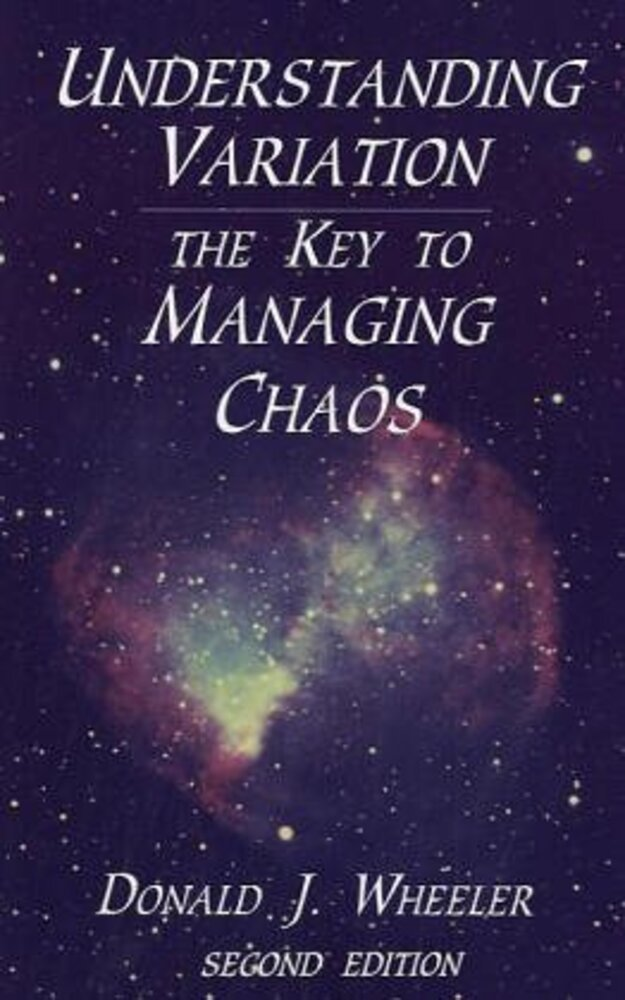

{width=50%}

A case study from *Understanding Variation: The Key to Managing Chaos* by Dr. Donald J. Wheeler

*We live in the Information Age, and much of that information comes to us in the form of numbers. Before numerical information can be useful, however, it must be analyzed, interpreted, and assimilated. Unfortunately, teaching the techniques for making sense of data has been neglected at all levels of our educational system. As a result, throughout our culture there is little appreciation of how to effectively use the volumes of data generated by business, government, and the media. This book is the remedy.*

*Readers report that this book has changed both the way they look at data and the very form of their monthly reports. It has turned arguments about the numbers into a common understanding of what needs to be done about them. These techniques and benefits have been thoroughly proven in a wide variety of settings. Read this book and use the techniques to gain the benefits for yourself and your organization.*

Slide 2

## The World According to the Monthly Report

{width=100%}

*Managing a company by means of the monthly report is like trying to drive a car by watching the yellow line in the rear-view mirror* Dr. Myron Tribus, former director of the Center for Advanced Engineering Study at MIT

All data should be presented in the proper context.

- Is the value lower or higher than usual?

- Is there a signal that something changed or is it just random variation (noise)?

- Is there a trend?

Slide 3

## A Typical Management Report

**Scenario**

A manufacturing company's stock is stagnate, primarily because it's profits are constant when it's revenues are increasing.

A major division of this company is accused of "not carrying it's weight."

The Director of the Division has called a meeting of the Division's managers to discuss the monthly report and find out what's going wrong.

**The Meeting**

Most of the discussion centers around the In-Process Inventory (up 42% from Monthly Average).

It was agreed that the Finance Dept. would study why In-Process Inventory was so high, write a report, and present it so that action plans could be developed.

This was their top priority.

Slide 4

**The Analysis**

The Finance Dept. manager assigned the project to an analyst.

The analyst just had a statistics course and decided to try applying some "new" techniques.

These techniques required looking at the data in the form of a time series and applying control limits.

Slide 5

The first step to showing data in the proper context is to create an Run Chart: a visual representation of time series data; a plot of data over time.

Slide 6

**Conclusion**

While the In-Process Inventory value of 28 in July was the highest to date, it was not different statistically than the previous 30 months.

Looking for the cause of the division's poor performance in the In-Process Inventory numbers would be futile.

Obviously the reasons for poor performance were elsewhere.

Slide 7

**Conclusion**

While the In-Process Inventory value of 28 in July was the highest to date, it was not different statistically than the previous 30 months.

Looking for the cause of the division's poor performance in the In-Process Inventory numbers would be futile.

Obviously the reasons for poor performance were elsewhere.

Slide 8

**Conclusions**

There were several unusually low months:

- Jul., Aug. & Sep. of Year 1

- Apr. & May of Year 3

The current month was not unusual, but the fact that the process is out-of-control indicates that more unusually low months are likely to occur in the future.

This was not indicated by the favorable metrics for On-Time Shipments in July.

Slide 9

**Lesson Learned**

Control charts are a way to listen to your process.

When you listen to the Voice Of the Process as revealed by control charts, you can often detect signals that you would otherwise miss.

Voice Of The Process (VOP):  Term used to describe what the process is telling you. What it is capable of achieving, whether it is under control and what significance to attach to individual measurements - are they part of natural variation or a signal that needs to be dealt with?

http://www.isixsigma.com/dictionary/Voice_Of_The_Process_VOP-869.htm

Slide 10

**Next Steps**

The analyst was aware that the company was concerned about the amount of premium freight it currently spent.

Therefore the analyst decided to see if these techniques would confirm this suspicion.

Slide 11

**Conclusions**

There was an improvement after the first 4 months of Year 1.

However this improvement disappeared in Oct. of Year 2.

So the suspicion of excessive premium freight was correct, but it has been going on for quite a while and appears to be getting worse.

Slide 12

To confirm this suspicion, the analyst decided to examine the Percentage of Premium Freight Costs rather than the percent of shipments.

Slide 13

**Conclusions**

This confirmed the previous analysis.

It was discovered that there was a policy change in April of Year 1 that decreased the use of premium freight.

However there was no apparent reason for the increase starting at the end of Year 2.

However, the increase appears to be stable, not getting worse.

Slide 14

**Next Steps**

While examining premium freight looked promising, it did not appear on the monthly report.

The analyst decided to return to the monthly report to see what else could be found.

The next area of concern was First Time Approval (down 23% from Monthly Average).

Slide 15

**Conclusions**

The data appears to be in control, but there is an obvious pattern - every 3rd point is much greater than the previous 2 points.

This was explained by the fact that the quarterly rates are reported to corporate headquarters - the plant was taking extra precautions to ensure the reports were favorable.

While this situation warrants action, it has been going on continuously and so does not explain the current poor performance.

Slide 16

**Next Steps**

It occurred to the analyst that the "extra precautions" the plant was taking to get favorable First-Time Approval reports should show up somewhere else.

Before going on to other areas, the analyst decided to see if the Pounds Scrapped provided any clues (only -3.9% Difference from Monthly Average).

Slide 17

**Conclusions**

Scrap goes up in colder months, and it goes down in warmer months.

Therefore, the low value in July was not that unusual given this trend.

This observation points to a situation that could be easily corrected with the proper controls.

But this course of action will not bring the analyst any closer to the objective of finding the cause of poor Division performance.

Slide 18

**Next Steps**

The next area of concern was On-Time Closing of Accounts (down 21.8% from Monthly Average).

Slide 19

**Conclusions**

The current value in July of 26 is the lowest to date and is a signal that something changed.

Also, the goal was 95% On-Time Closings, but the process was giving 90% (31.5 out of 35 departments on average).

In order to determine why July was low and the goal is not being meet requires digging deeper into the closing time of each department, not the aggregate of all departments.

Slide 20

**Next Steps**

Once again, while the On-Time Closing metrics could be better, they have been poor for quite a while and the one bad month of July would not explain why the Division was performing poorly.

The analyst decided to look at the only thing left on the Monthly Report:  Material Costs.

The metrics were somewhat favorable, so they did not receive any attention at the Director's meeting (% Diff ranged from -4.2 to 7.0).

Slide 21

**Conclusions**

A project team was formed in Year 1 and given the job of reducing material costs in Dept. 13:

- The first change dropped costs from $215 to $208

- The second change dropped costs to $205

- The third change dropped costs to $201

- The fourth change dropped costs to $198

The project did it's job and was given an award at the end of Year 2.

Slide 22

The analyst decided to look at the man-hours per 100 pound data to see if there are any effects of the project team's changes.

Slide 23

**Conclusions**

Each and every change made by the project team had the effect of increasing the actual labor content of the product.

Slide 24

The analyst decided to look at the production volumes to see if there are any effects of the project team's changes.

Slide 25

**Conclusions**

The first 8 values suggest an upward trend.

But then, following the first process change, the volumes dropped and continue to decline.

Thus, the production volumes are down while the man-hours are up - a classic description of declining productivity, and this was totally hidden in the Monthly Report.

Slide 26

The analyst decided to look at energy and fixed costs of production to see if there are any effects of the project team's changes.

Slide 27

**Conclusions**

The energy and fixed costs have risen steadily.

This can be explained by inflation and the increased costs of doing business.

Slide 28

The analyst decided to look at total production costs to see if there are any effects of the project team's changes.

Slide 29

**Conclusions**

The first process change resulted in a definite drop in costs, but these savings eroded by the beginning of Year 2.

The second process change caused another drop in costs.

Finally, even though the final change at the beginning of Year 3 did reduce the material costs, increases in other costs offset this savings.

Still, they appear to be doing better than Year 1.

Slide 30

**Next Steps**

While the total cost data and the material cost data look good and the energy and fixed costs increases are expected, there are some indications of trouble in the man-hours and production volume data.

One dimension to the problem that is missing is the quality of the product.

This is reflected in the Scrap Percentages reported by Dept. 14, which receives material from Dept. 13.

Slide 31

**Conclusions**

Every change made by the project team resulted in an increase in the amount of scrap in Dept. 14.

The negative impact of the project team's efforts was not seen because of the artificial boundary created by the "departments" and the subsequent partitioning of the management data.

***While everyone was minding their own department, no one was minding the big picture.***

Slide 32

**Next Steps**

The analyst decided to delete the pounds of scrap produced in Dept. 14 from the total amount of product produced in Dept. 13 and recalculate the production costs to see if that would tell a different story - "Honest" Production Costs.

Slide 33

**Conclusions**

The project team effectively increased the total cost of the finished product - and they got an award for doing it!

This provides evidence of Dr. Deming's first theorem:  "No one gives a hoot about profit" - if they did they would be interested in learning better ways to make them.

Slide 34

**Next Steps**

The analyst decides to see what would have happened if the changes in Dept. 13 had not been made.

The analyst assumes material costs go up 5% each year and estimates total production costs based on the data provided by the first 8 months of Year 1.

Slide 35

**Conclusions**

The company would be much better off today if they never implemented the project team's changes!

**Next Steps**

The root cause of poor company performance has be found.

Now it's time to write the report of findings and deliver a presentation to the Director and other plant managers.

**Epilogue**

The story you have just seen is true.

The names have be changed to protect the innocent, and the guilty.

Unfortunately, our hero had to find employment elsewhere - I'm sure you can guess why.

Slide 36

**Lessons Learned**

A manager must look at the whole picture, not just the narrow slices provided by the departmental figures. The artificial boundaries created by departments can distort both the data and the system.

Good accounting practices for a whole company may be inappropriate when applied on a departmental level. Trying to micro-manage and micro-account can result in severe distortions of the data.

When it comes to pleasing our customers, the important figures are unknown and unknowable. It is dangerous to run a company using only the visible figures.

Some figures have the seeds of distortion built-in.

Slide 37

**Example**

One transportation department was tracking the "transportation utilization efficiency."

If someone decided to make this number look better, they could simply wait until they had full loads before shipping any product.

Of course this would have a negative impact upon the figures for on-time shipments, and would result in unhappy customers - but it would certainly make the utilization numbers look good.

Slide 38

**Lessons Learned** (Cont.)

The optimization of each department will always result in a plant which is suboptimal.

The optimization of the whole system will require that some departments be operated suboptimally.

However, by encouraging competition between managers, most organizations make it impossible for departments to cooperate for the good of the company.

"To optimize the whole, we must suboptimize the parts." - W. Edwards Deming

[http://www.stcollab.com/why.html]

Slide 39

The main lesson learned from the Beer Game is the Bullwhip Effect.

Bullwhip Effect:  The variability in demand is magnified as we move from the customer to the producer in the supply chain. 

[http://highered.mcgraw-hill.com/sites/0072506369/student_view0/chapter9/glossary.html]

The bullwhip effect is a well-established, frequent, and expensive occurrence:  modest fluctuations in consumer demand are dramatically amplified as they proceed up the supply chain from retailer to assembler to manufacturer to raw material supplier.

This is primarily due to the failure to distinguish between common cause variation and special cause variation and everyone trying to do their best:  working harder instead of smarter.  As management and employees react to common cause variation, they tamper with the system and actually create more variation.

Slide 40

**What to Do**

Begin to collect the right data.

- Both the data you collect and the data you report need to be useful, correct, and undistorted by artificial boundaries.

- Data which describe the activity are better than data which describe the side effects of the process.

- Likewise, data which concern those things which the manager can control are more useful than mere report card data.

Insist upon interpreting data within their context.

- This will immediately require, among other things, a transformation of the monthly management report.

Slide 41

**What to Do** (cont.)

Filter out the noise before interpreting any value as a potential signal.

- The failure to do so is a mark of numerical illiteracy, and the illiterate are fair game for the con-artist.

Cease to ask for explanations of noise.

- In the absence of an identifiable signal, the current value cannot be said to differ from the preceding values.

- In the absence of a detectable signal, no amount of explanation, however well worded and reasoned, can be supported by the data.

Slide 42

**What to Do** (cont.)

Understand that no matter how the results may stack up against the specifications, a process which displays statistical control is performing as consistently as possible.

Always distinguish between the Voice of the Process and the Voice of the Customer.

-  You cannot begin to get these two voices into alignment until you understand how they differ.

Help others take action on assignable causes.

- Knowing the assignable cause is only the first step.

- Detrimental assignable causes need to be eliminated.

- Beneficial ones need to be made part of the process.

Slide 43

GM Problem Solving:  Identify, Analyze, Plan, Implement, Evaluate (IAPIE) [just think of the London Underground (a.k.a. The Tube):  "Mind The Gap"].

"No amount of sophistication is going to allay the fact that all your knowledge is about the past and all your decisions are about the future." - Ian E. Wilson, former chairperson, General Electric

**Deming's Theory of knowledge**

Management = Prediction 

Knowledge is built on theory - build an hypothesis which: predicts a future outcome; identifies risk of being wrong (confidence level); must fit, without failure, with the observations of the past.

Without theory, we have nothing to revise, nothing to learn.

There is no true value, effected by: changes in how the measurements are taken; changes in how the measurements are defined. 

Information is not knowledge:  a statement devoid of rational prediction does not convey knowledge.

[http://members.aol.com/kaizensepg/deming.htm]

**References**

[1] https://www.spcpress.com/book_understanding_variation.php

[2] http://www.ifilm.com/ifilmdetail/2457763?htv=12